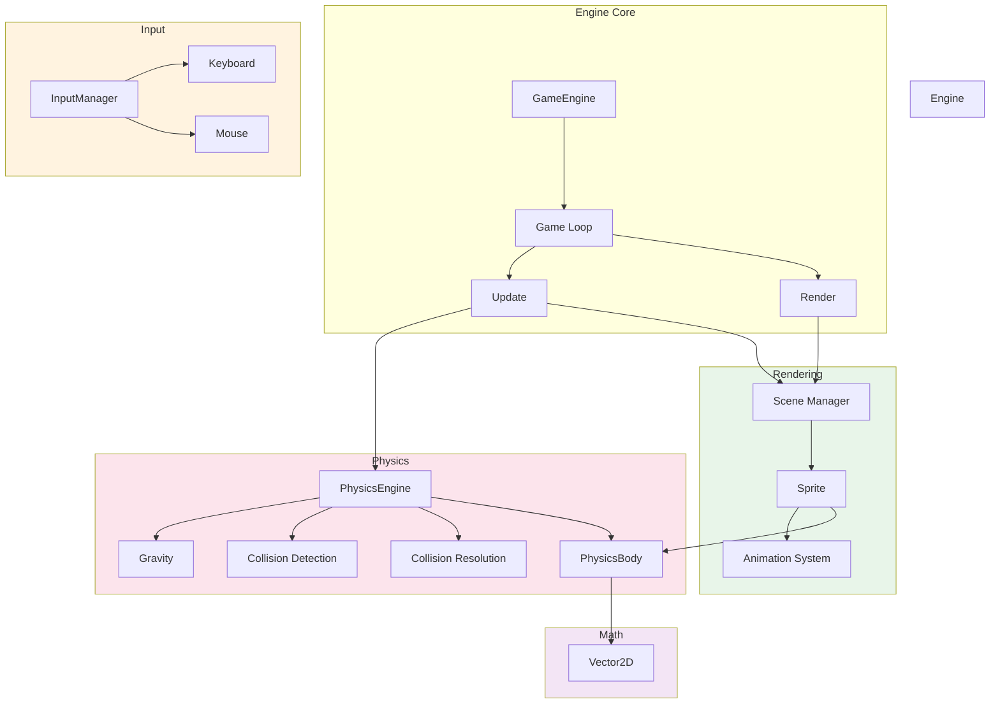
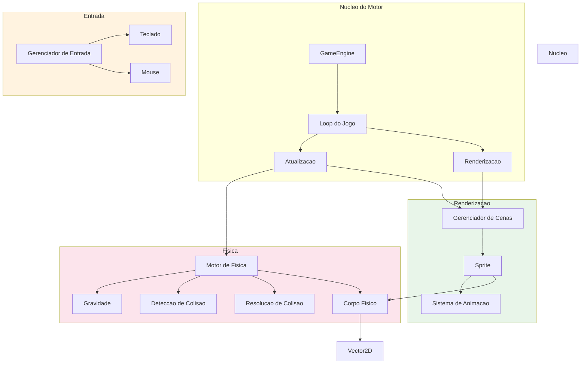

# Game Development Engine JS

2D game development engine built with JavaScript and HTML5 Canvas, featuring a physics engine with collision detection, sprite management, scene system, input handling, and a fixed-timestep game loop.

[English](#english) | [Portugues](#portugues)

---

## English

### Overview

A lightweight 2D game engine that provides the core systems needed for browser-based game development. Includes a physics engine with gravity, collision detection and resolution, a sprite system with animation support, scene management, keyboard and mouse input handling, and an FPS-capped game loop.

### Architecture



### Features

- Vector2D math library with operations (add, subtract, scale, normalize, dot product, distance)
- Physics engine with configurable gravity, mass, friction, and restitution
- AABB collision detection and resolution with impulse-based response
- Sprite rendering with animation frame support
- Scene management for organizing game objects
- Keyboard and mouse input tracking
- Fixed-timestep game loop with FPS counter
- Static and dynamic physics bodies

### Quick Start

```bash
git clone https://github.com/galafis/Game-Development-Engine-JS.git
cd Game-Development-Engine-JS
npm install
npm start
```

### Project Structure

```
Game-Development-Engine-JS/
├── main.js            # Engine core with all systems
├── tests/
│   └── main.test.js   # Test suite
├── package.json
└── README.md
```

### Tech Stack

| Technology | Purpose |
|------------|---------|
| JavaScript ES2024 | Engine implementation |
| HTML5 Canvas | 2D rendering |

### License

MIT License - see [LICENSE](LICENSE) for details.

### Author

**Gabriel Demetrios Lafis**
- GitHub: [@galafis](https://github.com/galafis)
- LinkedIn: [Gabriel Demetrios Lafis](https://linkedin.com/in/gabriel-demetrios-lafis)

---

## Portugues

### Visao Geral

Um motor de jogos 2D leve que fornece os sistemas centrais necessarios para desenvolvimento de jogos baseados em navegador. Inclui motor de fisica com gravidade, deteccao e resolucao de colisoes, sistema de sprites com suporte a animacao, gerenciamento de cenas, tratamento de entrada por teclado e mouse, e loop de jogo com FPS limitado.

### Arquitetura



### Funcionalidades

- Biblioteca matematica Vector2D com operacoes (adicao, subtracao, escala, normalizacao, produto escalar, distancia)
- Motor de fisica com gravidade, massa, atrito e restituicao configuraveis
- Deteccao de colisao AABB e resolucao com resposta baseada em impulso
- Renderizacao de sprites com suporte a quadros de animacao
- Gerenciamento de cenas para organizar objetos do jogo
- Rastreamento de entrada por teclado e mouse
- Loop de jogo com timestep fixo e contador de FPS
- Corpos fisicos estaticos e dinamicos

### Inicio Rapido

```bash
git clone https://github.com/galafis/Game-Development-Engine-JS.git
cd Game-Development-Engine-JS
npm install
npm start
```

### Licenca

Licenca MIT - veja [LICENSE](LICENSE) para detalhes.

### Autor

**Gabriel Demetrios Lafis**
- GitHub: [@galafis](https://github.com/galafis)
- LinkedIn: [Gabriel Demetrios Lafis](https://linkedin.com/in/gabriel-demetrios-lafis)
